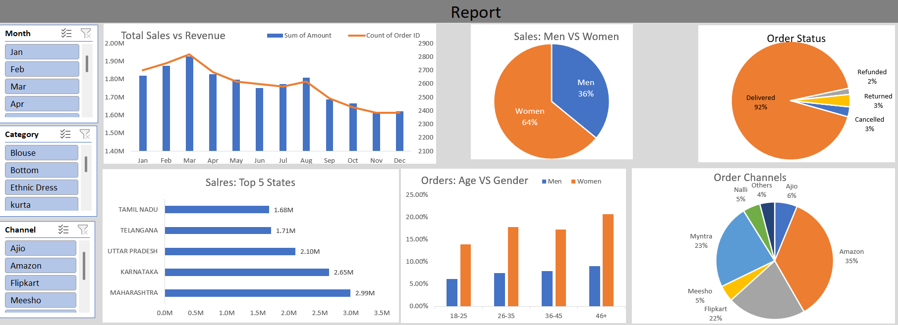

# Store Data Analysis

## Project Overview

This project analyzes Vrinda Store sales data using Microsoft Excel to identify customer purchasing behavior, sales trends, and business performance. An interactive dashboard was created using Pivot Tables, Pivot Charts, and Slicers to support data-driven decision-making.

---

## Objectives

- Analyze sales performance
- Identify top-performing states and sales channels
- Understand customer demographics
- Discover best-selling product categories
- Build an interactive Excel dashboard

---

## Tools Used

- Microsoft Excel
- Pivot Tables
- Pivot Charts
- Slicers
- Conditional Formatting
- Data Cleaning

---

## Dataset

The dataset contains order-level sales information including:

- Order Status
- Customer Gender
- Age Group
- State
- Sales Channel
- Product Category
- Order Amount
- Month

---

## Data Cleaning

Performed the following preprocessing steps:

- Checked for missing values
- Removed duplicate records
- Standardized categorical values
- Verified data consistency
- Created helper columns where required

---

## Dashboard Features

The dashboard provides interactive analysis of:

- Monthly Sales
- Sales by State
- Sales by Channel
- Orders by Gender
- Orders by Age Group
- Category-wise Performance

Users can filter the dashboard using slicers for dynamic analysis.

---

## Key Insights

- Women contributed the highest percentage of total sales.
- Adult customers generated the majority of revenue.
- Amazon was the leading sales channel.
- Maharashtra recorded the highest sales.
- Clothing categories generated the maximum revenue.

---

## Dashboard Preview

---

## Skills Demonstrated

- Data Cleaning
- Data Analysis
- Business Analysis
- Dashboard Design
- Data Visualization
- Microsoft Excel

---

## Author

**Shashwat Sharma**

LinkedIn: www.linkedin.com/in/shashwats07

GitHub: www.github.com/shashwat-pvtt
